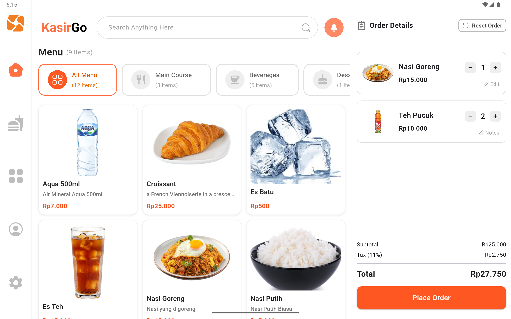

# 📠 KasirGo - Modern Point of Sale (POS) Application



> A high-performance, aesthetically pleasing mobile POS application built with Flutter, designed to streamline retail operations with smart caching and robust state management.

---
## 📖 Overview
KasirGo is a modern solution for small to medium retail businesses. Unlike traditional clunky POS systems, KasirGo focuses on **User Experience (UX)** and **Performance**. The app connects to a robust Django backend (**[View Backend Repository](https://github.com/SiEncan/KasirGo-Backend)**) but is engineered to handle network instability gracefully through robust error handling and smart image caching.

---

## ✨ App Features

### 🛒 Smart Point of Sales (POS)
-   **Dynamic Cart Manager**: Add items, adjust quantity, reset order, and view real-time calculations (Subtotal, Tax, Final Total).
-   **Catalog Browsing**: Filter products by **Category** or use **Search** to quickly find items.
-   **Granular Notes**: Add specific notes per item (e.g., "No Spicy", "Less Ice") and Transaction notes (e.g. "GoFood", "Sambelnya Dipisah").
-   **Order Modes**: Support for **Dine In** and **Take Away**. Automatically applies configurable *Take Away Charges*.

### 💳 Flexible Checkout & Payments
-   **Multiple Payment Methods**: Support for **Cash** and **QRIS**.
-   **Payment Gateway Integration**: Integrated with **Duitku** for seamless QRIS generation and status checking.
-   **Smart Change Calculation**: Auto-calculate change for cash payments.

### 📦 Inventory & Catalog Control
-   **Full CRUD Management**: Add, Edit, and Delete Products and Categories with ease.
-   **Smart Management**: Filter inventory by Category or Search to quickly update products.
-   **Product Image Upload**: Supports uploading product images directly from device gallery (sent as **Multipart/Form-Data** to the backend).
-   **Automated Stock System**:
    -   Stock decreases automatically upon checkout.
    -   **Auto-OOS**: Products automatically marked "Unavailable" when stock hits 0, removing them from the menu.

### 📝 Transaction History & Management
-   **Advanced Search**: Filter transactions by `Transaction No`, `Customer Name`, or `Notes`.
-   **Digital Receipt**: Detailed transaction view mimicking a real receipt.
-   **Void/Edit Transaction**:
    -   Edit Customer Name or Notes after transaction.
    -   **Safe Delete**: Deleting a transaction automatically **restores stock** to inventory.

### ⚙️ Store & Profile Settings
-   **Shop Configuration**: Customize Shop Name, Address, and Phone Number for receipts.
-   **Tax & Fees**: Configure Global Tax (%) and Takeaway Charges with a **Live Calculation Preview**.
-   **Local Persistence**: Settings are saved locally on the device for quick access.
-   **Profile Management**: easy-to-use profile update screen.

---

## 🛠 Technical Highlights

### ⚡ Performance Optimization
-   **Image Caching**: Implemented `CachedNetworkImage` with custom `memCacheWidth` to reduce memory usage by ~90% during heavy scrolling.
-   **Debounced Search**: Optimized live search to prevent API flooding.

### 🛡️ Security & Networking (Dio)
-   **Smart Authentication**: Auto-refresh JWT tokens using **Dio Interceptors** ensuring uninterrupted sessions.
-   **Robust Error Handling**: Centralized error interceptor to gracefully handle timeouts and connection failures.

### 🏗️ State Management (Riverpod)
-   **Unidirectional Data Flow**: Using Riverpod 2.0 Notifiers for predictable state changes.
-   **Separation of Concerns**: Business logic decoupled from UI widgets.


---

## 💡 Key Challenges & Solutions

### 1. High-Resolution Image Lag
- **Challenge**: Loading hundreds of product images (4MB+ each) in a `GridView` caused significant frame drops and memory spikes on mid-range devices.  
- **Solution**: Implemented `CachedNetworkImage` with specific `memCacheWidth` parameters. This forces the engine to decode images into smaller thumbnails in RAM, reducing memory usage by **~90%** and achieving 60 FPS scrolling.

### 2. Complex Cart State Synchronization
- **Challenge**: Managing cart updates (add, remove, update quantity, notes) across multiple screens caused data inconsistency.  
- **Solution**: Leveraged **Riverpod's Immutable State** pattern (`CartState`). Every update recreates the state object, ensuring UI rebuilds are predictable and eliminating "ghost items" in the cart.

### 3. Efficient Configuration Persistence
- **Challenge**: Storing lightweight settings (Tax Rate, Takeaway Charges) in the database requires unnecessary schema changes, while keeping them in Riverpod state causes data loss on restart.  
- **Solution**: Implemented a **Local-First Strategy** using `SharedPreferences`. Settings are persisted locally on the device, ensuring they survive app restarts without bloating the backend database.

### 4. Secure Authentication Persistence
- **Challenge**: Storing sensitive JWT tokens in `SharedPreferences` is insecure and prone to leaks.  
- **Solution**: Integrated **Flutter Secure Storage** to encrypt tokens in the device's Keystore/Keychain. Coupled with **Dio Interceptors**, the app silently refreshes tokens without user intervention, balancing security with UX.

### 5. Live Search Performance
- **Challenge**: Searching through thousands of transaction records caused API spam and UI freezing.  
- **Solution**: Implemented **Debouncing** (500ms) on the search input and optimized State Notifiers to only redraw the list when necessary, preventing unnecessary builds.

---

## 🍳 Kitchen Display System (KDS) & Hybrid Architecture

KasirGo features a **Real-Time Kitchen Display System** that syncs with the POS without complex server infrastructure.

### 📡 Hybrid Architecture (Signal + Fetch)
Instead of syncing complex order data to Firebase (which creates data integrity risks), we use a **Hybrid Approach**. Here is the step-by-step flow:

1.  **[KDS]**: When the Kitchen App opens, it connects to Firebase and starts *listening* for signals at `store_1/kitchen_trigger`.
2.  **[POS]**: Cashier completes a transaction. The app saves the full order details to the **Django SQL Database** (Authoritative Source).
3.  **[POS]**: Once saved, the app sends a lightweight *Timestamp Signal* to Firebase.
4.  **[Firebase]**: Instantly broadcasts this signal to all listening devices (WebSocket).
5.  **[KDS]**: Receives the signal ("Ding!").
6.  **[KDS]**: Reacts by asking Django: *"Hey, give me the latest open orders!"* (Fetch API).
7.  **[KDS]**: Updates the screen with the verified data from Django.

**Benefit:** 100% Data Integrity. Zero chance of "Ghost Orders" or data mismatch, with Real-Time experience.

### 🛠️ Firebase Setup (Optional for Real-Time)
The KDS works in **Manual Refresh Mode** by default. To enable **Real-Time Automatic Updates**, you must configure Firebase:

1.  **Add Configuration File**: 
    -   Place `google-services.json` in `android/app/`.
    -   *Note: This file is git-ignored for security.*
    
2.  **Security Rules (No Auth Required)**:
    -   We use **Structure Validation** to secure the DB without needing Firebase Auth.
    -   Copy this to your Firebase Console Rules:
    ```json
    {
      "rules": {
        "store_1": {
          "kitchen_trigger": {
            ".read": true,
            ".write": "newData.isNumber()" 
          }
        }
      }
    }
    ```

### 👨‍🍳 Smart Features
-   **Startup Mode Selection**: Choose between **POS Role** or **Kitchen Role** at login. Selection is remembered permanently until you switch it.
-   **Smart Routing**: Only items marked "Needs Preparation" are sent to KDS. Grab & Go items (like bottled water) skip the kitchen.
-   **Queue Management**: FIFO (First-In-First-Out) display for chefs.

---

## 🧰 Tech Stack


-   **Framework**: [Flutter](https://flutter.dev/) (SDK 3.x)
-   **State Management**: [Riverpod 2.0](https://riverpod.dev/) (Unidirectional Data Flow)
-   **Networking**: Dio (with Interceptors for error handling)
-   **Assets & UI**: 
    -   `cached_network_image`: Optimized image loading.
    -   `qr_flutter`: Generate QRIS codes for dynamic payments from *Duitku* payment gateway.
    -   `barcode_widget`: Render Code 128 barcodes for transaction receipts.
-   **LocalStorage**: `flutter_secure_storage` for token management.

## 🏗 Architecture

This project follows a **Feature-First** directory structure to ensure distinct separation of concerns and scalability.

```
lib/
├── providers/       # Global State Management (Riverpod)
├── screen/          # UI Logic (Features)
│   ├── home/        # Dashboard & POS Interface
│   ├── history/     # Transaction Logs with Search
│   ├── products/    # CRUD Operations
│   └── checkout/    # Payment Flows
├── services/        # API Communication Layer (Repository Pattern)
└── utils/           # Shared Helpers (Formatters, Dialogs)
```

---

## 🚀 Getting Started

### 1️⃣ Clone the repository
```bash
git clone https://github.com/SiEncan/kasirgo.git
cd kasirgo
```

### 2️⃣ Install dependencies
```bash
flutter pub get
```

### 3️⃣ Run on emulator or device
```bash
flutter run
```
Make sure you have Flutter SDK installed and an emulator/device ready.
